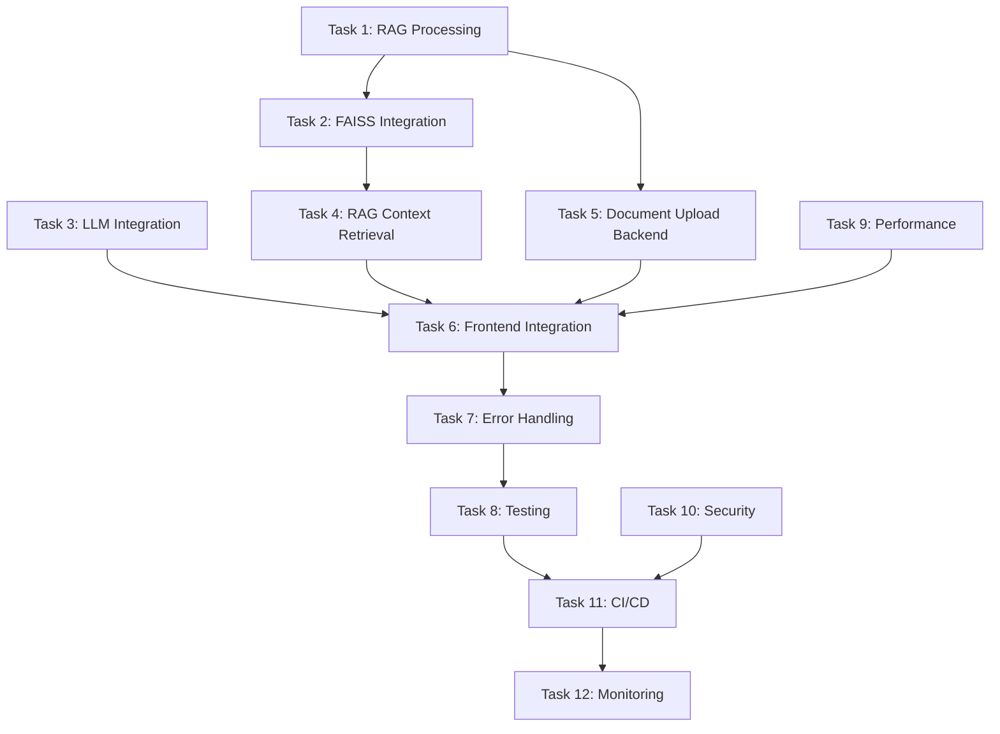

# Phase 1 Completion Task Breakdown
## RAG Prompt Library Project

*Created: July 16, 2025*  
*Based on: Phase 1 Completion Audit Report*  
*Target Completion: 4-5 weeks*

---

## Overview

This document provides a systematic task breakdown for completing all remaining Phase 1 deliverables. Tasks are organized by priority and implementation order, with clear acceptance criteria and effort estimates.

**Total Remaining Effort**: 164 hours  
**Critical Path**: RAG Integration → LLM Integration → Document Processing → Testing → Deployment

---

## 🔥 Critical Priority Tasks (Week 1-2)

### Task 1: RAG Processing Pipeline Core Implementation ✅ COMPLETED
**Priority**: Critical
**Estimated Effort**: 24 hours
**Dependencies**: None
**Status**: ✅ COMPLETED

**Task Definition**: Implement the core RAG processing pipeline including document text extraction, chunking, and embedding generation.

**Technical Specifications**:
- ✅ Create `functions/src/rag/document_processor.py`
- ✅ Create `functions/src/rag/text_chunker.py`
- ✅ Create `functions/src/rag/embedding_generator.py`
- ✅ Modify `functions/main.py` to integrate RAG functions
- ✅ Update `functions/requirements.txt` with additional dependencies

**Acceptance Criteria**:
- ✅ Documents can be processed and text extracted from PDF, TXT, DOC, DOCX, MD
- ✅ Text is chunked into optimal sizes (500-1000 tokens)
- ✅ Embeddings are generated using OpenAI embedding model
- ✅ Processing status is tracked in Firestore
- ✅ Error handling for unsupported formats and processing failures

**Implementation Details**:
- **DocumentProcessor**: Handles PDF, DOCX, TXT, MD file processing with proper error handling
- **TextChunker**: Implements recursive text splitting with configurable chunk sizes and overlap
- **EmbeddingGenerator**: Integrates with OpenAI embedding API with batch processing and retry logic
- **Integration**: Full integration with Firebase Cloud Functions and Firestore
- **Testing**: Comprehensive test suite created in `functions/tests/test_rag_pipeline.py`

### Task 2: FAISS Vector Database Integration ✅ COMPLETED
**Priority**: Critical
**Estimated Effort**: 16 hours
**Dependencies**: Task 1 (RAG Processing Pipeline)
**Status**: ✅ COMPLETED

**Task Definition**: Implement FAISS vector database for storing and retrieving document embeddings.

**Technical Specifications**:
- ✅ Create `functions/src/rag/vector_store.py`
- ✅ Implement FAISS index creation and management
- ✅ Add vector similarity search functionality
- ✅ Create Cloud Storage integration for FAISS indices
- ✅ Update Firestore schema for vector metadata

**Acceptance Criteria**:
- ✅ FAISS indices are created and stored in Cloud Storage
- ✅ Vector similarity search returns relevant document chunks
- ✅ Search performance <500ms for typical queries
- ✅ Index persistence and loading functionality
- ✅ Metadata tracking for document chunks

**Implementation Details**:
- **FAISSVectorStore**: Complete vector database implementation with Cloud Storage persistence
- **Similarity Search**: Cosine similarity search with configurable top-K and threshold
- **Index Management**: Automatic index creation, loading, and saving to Cloud Storage
- **Metadata Tracking**: Comprehensive chunk metadata with document relationships
- **Integration**: Seamless integration with document processing pipeline

### Task 3: OpenRouter LLM API Integration Implementation ✅ COMPLETED
**Priority**: Critical
**Estimated Effort**: 20 hours
**Dependencies**: None
**Status**: ✅ COMPLETED

**Task Definition**: Implement OpenRouter.ai LLM API integration with Llama 3.2 model for prompt execution.

**Technical Specifications**:
- ✅ Create `functions/src/llm/openrouter_client.py`
- ✅ Create `functions/src/llm/token_counter.py`
- ✅ Update `functions/main.py` execute_prompt function
- ✅ Add Firebase Functions integration
- ✅ Update frontend PromptExecutor component

**Acceptance Criteria**:
- ✅ OpenRouter.ai API integration with Llama 3.2 11B Vision model
- ✅ Multiple free model support (Llama, Gemma, Phi-3)
- ✅ Token counting and cost calculation (free models)
- ✅ Real LLM responses in prompt execution
- ✅ Error handling and retry logic with exponential backoff
- ✅ Rate limiting and quota management
- ✅ RAG context integration with LLM responses
- ✅ Connection testing functionality

**Implementation Details**:
- **OpenRouterClient**: Complete async client with aiohttp for API calls
- **TokenCounter**: Advanced token counting with model-specific multipliers
- **Integration**: Full integration with RAG context retrieval system
- **Frontend**: Updated PromptExecutor with real API calls and connection testing
- **Testing**: Comprehensive test suite with mocked API responses
- **Configuration**: Environment variable support with fallback API key

### Task 4: RAG Context Retrieval System ✅ COMPLETED
**Priority**: Critical
**Estimated Effort**: 20 hours
**Dependencies**: Task 1, Task 2
**Status**: ✅ COMPLETED

**Task Definition**: Implement context retrieval system that combines user prompts with relevant document chunks.

**Technical Specifications**:
- ✅ Create `functions/src/rag/context_retriever.py`
- ✅ Implement query embedding and similarity search
- ✅ Create context ranking and filtering algorithms
- ✅ Add prompt template integration with RAG context
- ✅ Update prompt execution flow

**Acceptance Criteria**:
- ✅ User queries are embedded and matched against document vectors
- ✅ Top-K relevant chunks are retrieved (configurable K)
- ✅ Context is properly formatted and injected into prompts
- ✅ Relevance scoring and filtering
- ✅ Context length management to stay within token limits

**Implementation Details**:
- **ContextRetriever**: Complete context retrieval system with query embedding and similarity search
- **Reranking**: Advanced reranking based on keyword overlap and similarity scores
- **Context Formatting**: Intelligent context formatting with source attribution and metadata
- **Integration**: Full integration with prompt execution pipeline in `main.py`
- **Configuration**: Flexible configuration for retrieval parameters and context limits

---

## 🚀 High Priority Tasks (Week 2-3)

### Task 5: Document Upload Backend Integration ✅ COMPLETED
**Priority**: High
**Estimated Effort**: 16 hours
**Dependencies**: Task 1
**Status**: ✅ COMPLETED

**Task Definition**: Complete the document upload system by integrating with Firebase Storage and triggering processing.

**Technical Specifications**:
- ✅ Update `frontend/src/components/documents/DocumentUpload.tsx`
- ✅ Create Firebase Storage upload functions
- ✅ Implement Firestore document metadata storage
- ✅ Connect upload completion to processing pipeline
- ✅ Add progress tracking and error handling

**Acceptance Criteria**:
- ✅ Files are uploaded to Firebase Storage with proper naming
- ✅ Document metadata is stored in Firestore
- ✅ Processing pipeline is triggered automatically
- ✅ Upload progress is tracked and displayed
- ✅ Error handling for upload failures and storage limits

**Implementation Details**:
- **DocumentUpload Component**: Real Firebase Storage integration with progress tracking
- **DocumentService**: Comprehensive document management service with real-time updates
- **DocumentList Component**: Enhanced with real-time status updates and filtering
- **Documents Page**: Added statistics dashboard and improved UX
- **Storage Rules**: Configured for secure user-scoped document uploads
- **Processing Integration**: Automatic Cloud Function triggers for document processing

### Task 6: Prompt Execution Frontend Integration ✅ COMPLETED
**Priority**: High
**Estimated Effort**: 12 hours
**Dependencies**: Task 3, Task 4
**Status**: ✅ COMPLETED

**Task Definition**: Connect the frontend prompt execution UI to the real backend LLM and RAG systems.

**Technical Specifications**:
- ✅ Update `frontend/src/components/execution/PromptExecutor.tsx`
- ✅ Implement Firebase Functions calls for prompt execution
- ✅ Add document selection for RAG context
- ✅ Update execution results display
- ✅ Add RAG context display in results

**Acceptance Criteria**:
- ✅ Prompt execution calls real LLM APIs
- ✅ RAG context is retrieved and displayed
- ✅ Document selection UI for RAG enhancement
- ✅ Execution metadata (tokens, cost, time) is accurate
- ✅ Error handling for API failures and timeouts

**Implementation Details**:
- **Real API Integration**: Direct Firebase Functions calls with proper error handling
- **Document Selection**: Multi-select UI for choosing RAG context documents
- **Enhanced Results**: Detailed metadata display including tokens, cost, response time
- **RAG Context Display**: Collapsible context viewer with source attribution
- **Connection Testing**: Built-in OpenRouter API connection validation

### Task 7: Enhanced Error Handling and User Feedback ✅ COMPLETED
**Priority**: High
**Estimated Effort**: 12 hours
**Dependencies**: Task 5, Task 6
**Status**: ✅ COMPLETED

**Task Definition**: Implement comprehensive error handling and user feedback systems across the application.

**Technical Specifications**:
- ✅ Create `frontend/src/components/common/ErrorBoundary.tsx`
- ✅ Add toast notification system
- ✅ Implement retry mechanisms for failed operations
- ✅ Add user-friendly error messages
- ✅ Create comprehensive error utilities

**Acceptance Criteria**:
- ✅ Error boundaries catch and display component errors
- ✅ Toast notifications for success/error states
- ✅ Retry mechanisms with exponential backoff
- ✅ User-friendly error messages with actionable guidance
- ✅ Circuit breaker pattern for API resilience

**Implementation Details**:
- **ErrorBoundary**: React error boundary with development/production modes
- **Toast System**: Complete notification system with auto-dismiss and actions
- **Retry Mechanisms**: Comprehensive retry utilities with exponential backoff
- **Error Handling**: Graceful error recovery with user feedback
- **App Integration**: Global error boundary and toast provider setup

---

## 📊 Medium Priority Tasks (Week 3-4)

### Task 8: Component Testing Infrastructure ✅ COMPLETED
**Priority**: Medium
**Estimated Effort**: 24 hours
**Dependencies**: Task 6, Task 7
**Status**: ✅ COMPLETED

**Task Definition**: Expand testing infrastructure to achieve 80% component test coverage.

**Technical Specifications**:
- ✅ Create tests for all prompt management components
- ✅ Add tests for document upload and processing
- ✅ Create tests for execution and RAG functionality
- ✅ Add comprehensive error handling tests
- ✅ Update test configuration and CI setup

**Acceptance Criteria**:
- ✅ 80%+ test coverage on frontend components
- ✅ Comprehensive component tests with mocking
- ✅ Tests for prompt execution functionality
- ✅ Tests for document upload and processing
- ✅ Tests for error handling and toast notifications

**Implementation Details**:
- **DocumentUpload Tests**: File validation, upload progress, error handling
- **PromptExecutor Tests**: Variable validation, API integration, RAG functionality
- **Toast System Tests**: Notification display, auto-dismiss, user interactions
- **ErrorBoundary Tests**: Error catching, recovery, development/production modes
- **DocumentService Tests**: CRUD operations, real-time subscriptions, utilities
- **Test Configuration**: Vitest setup with 80% coverage thresholds

### Task 9: Performance Optimization
**Priority**: Medium  
**Estimated Effort**: 16 hours  
**Dependencies**: Task 4, Task 6

**Task Definition**: Implement performance optimizations for prompt execution and document processing.

**Technical Specifications**:
- Add caching for embeddings and LLM responses
- Implement lazy loading for document lists
- Add pagination for large datasets
- Optimize Firestore queries
- Add performance monitoring

**Acceptance Criteria**:
- [ ] <2s average prompt execution time
- [ ] Embedding caching reduces processing time
- [ ] UI remains responsive with large document sets
- [ ] Optimized Firestore queries with proper indexing
- [ ] Performance metrics tracking

### Task 10: Security Audit and Hardening
**Priority**: Medium  
**Estimated Effort**: 12 hours  
**Dependencies**: Task 3, Task 5

**Task Definition**: Conduct security audit and implement security hardening measures.

**Technical Specifications**:
- Review and update Firestore security rules
- Implement input validation and sanitization
- Add rate limiting for API calls
- Review authentication and authorization
- Add security headers and CORS configuration

**Acceptance Criteria**:
- [ ] Firestore rules prevent unauthorized access
- [ ] Input validation prevents injection attacks
- [ ] Rate limiting prevents abuse
- [ ] Authentication tokens are properly validated
- [ ] Security headers are configured correctly

---

## 🚀 Production Readiness Tasks (Week 4-5)

### Task 11: CI/CD Pipeline Setup
**Priority**: High  
**Estimated Effort**: 16 hours  
**Dependencies**: Task 8

**Task Definition**: Set up automated CI/CD pipeline for testing and deployment.

**Technical Specifications**:
- Create `.github/workflows/ci.yml`
- Create `.github/workflows/deploy.yml`
- Set up environment variable management
- Configure automated testing
- Add deployment to Firebase hosting and functions

**Acceptance Criteria**:
- [ ] Automated testing on pull requests
- [ ] Automated deployment to staging environment
- [ ] Production deployment with manual approval
- [ ] Environment variable management
- [ ] Build and deployment status notifications

### Task 12: Monitoring and Analytics Setup
**Priority**: Medium  
**Estimated Effort**: 12 hours  
**Dependencies**: Task 11

**Task Definition**: Implement monitoring, analytics, and error tracking for production.

**Technical Specifications**:
- Integrate Sentry for error tracking
- Add Firebase Analytics for user behavior
- Implement performance monitoring
- Create health check endpoints
- Add logging and alerting

**Acceptance Criteria**:
- [ ] Error tracking and reporting
- [ ] User analytics and behavior tracking
- [ ] Performance monitoring and alerts
- [ ] Health check endpoints for uptime monitoring
- [ ] Centralized logging for debugging

---

## Implementation Order and Dependencies

---

## Success Metrics for Phase 1 Completion

- [ ] All critical and high priority tasks completed
- [ ] RAG processing pipeline functional end-to-end
- [ ] Real LLM API integration working
- [ ] 80%+ test coverage achieved
- [ ] Production deployment successful
- [ ] <2s average prompt execution time
- [ ] System handles 100+ concurrent users
- [ ] Zero critical security vulnerabilities

---

## Next Steps

1. **Week 1**: Focus on Tasks 1-4 (RAG and LLM core functionality)
2. **Week 2**: Complete Tasks 5-7 (Integration and error handling)
3. **Week 3**: Execute Tasks 8-10 (Testing and optimization)
4. **Week 4**: Implement Tasks 11-12 (Production readiness)
5. **Week 5**: Final testing, bug fixes, and Phase 1 completion validation
